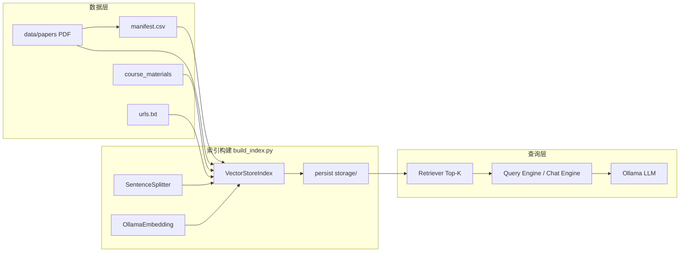

# ScholarLens 项目技术报告（详尽版）

**课程**：CS6493 Topic 3（NLP 项目）  
**仓库名**：ScholarLens  
**报告目的**：从动机、架构、实现细节、数据与评测、复现方法到局限与改进，对项目进行可交付级别的系统性说明。  
**文档生成说明**：本报告依据仓库内源代码与数据文件整理；部分实验数字来自项目内已运行的评测输出，报告中会标明来源与实验条件。

---

## 目录

1. [执行摘要](#1-执行摘要)  
2. [研究背景与问题定义](#2-研究背景与问题定义)  
3. [相关工作与语料定位](#3-相关工作与语料定位)  
4. [系统总体设计](#4-系统总体设计)  
5. [数据层：清单、论文与多源语料](#5-数据层清单论文与多源语料)  
6. [索引与检索：RAG 流水线](#6-索引与检索rag-流水线)  
7. [生成与交互：单轮、多轮、对比与 Web UI](#7-生成与交互单轮多轮对比与-web-ui)  
8. [评测体系：批量问答与 LLM-as-a-Judge](#8-评测体系批量问答与-llm-as-a-judge)  
9. [实验与结果](#9-实验与结果)  
10. [项目目录与模块对照](#10-项目目录与模块对照)  
11. [复现指南（逐步）](#11-复现指南逐步)  
12. [已知问题与工程注意事项](#12-已知问题与工程注意事项)  
13. [局限性与未来工作](#13-局限性与未来工作)  
14. [结论](#14-结论)  
15. [参考文献与链接](#15-参考文献与链接)  
16. [附录](#16-附录)

---

## 1. 执行摘要

ScholarLens 是一个基于 **LlamaIndex** 的 **学术论文问答（Academic Paper QA）** 系统，采用经典 **检索增强生成（RAG）**：将 PDF 论文、课程材料与可选网页内容统一索引到向量库中，在查询时通过 **稠密向量相似度** 召回相关文本块，再由本地 **Ollama** 提供的大语言模型生成答案。

项目在设计上的突出特点包括：

- **Manifest 驱动的元数据**：论文以 `manifest.csv` 登记，`paper_id` 等字段写入每个文档块，支持按单篇论文过滤检索。  
- **多源融合索引**：同一向量索引内融合论文、课程 `.md/.txt`、以及 `urls.txt` 中的网页 HTML。  
- **跨论文对比的分层检索（Stratified Retrieval）**：`compare_papers.py` 对两篇论文分别取 Top-K 再合并，缓解“单篇文档在向量空间中独大、占满检索槽位”的问题。  
- **评测闭环**：`data/eval/questions.json` 驱动批量问答，`score_eval.py` 以 **LLM-as-a-Judge** 输出 1–5 分及理由，并按题型汇总。

当前语料已覆盖 **10 篇** 与 RAG、推理、幻觉评测、开源 LLM、量化等主题相关的高引用论文；评测题库 **40 题**（事实题 24、跨论文题 8、推理题 8）。在 **chunk=512**、**top_k=5**、扩展结果文件 `data/eval/results_512_expanded.json` 对应的一次完整评测中，裁判模型给出的总体均分为 **3.40/5**，其中跨论文类题目均分相对较低（**2.62/5**），与“无分层检索的全库单通道 RAG”在强干扰语料下的行为一致，适合作为课程报告的讨论点。

---

## 2. 研究背景与问题定义

### 2.1 纯参数化 LLM 的短板

大语言模型知识主要存储在参数中，存在：

- **静态知识截止**：训练后无法自动获得最新文献或课程更新。  
- **事实性风险**：在缺少明确证据时仍可能生成看似合理但错误的内容（俗称“幻觉”）。  
- **可追溯性差**：难以像学术写作那样给出可核验的引用片段。

### 2.2 RAG 的解决思路

RAG（Lewis et al., 2020）将 **非参数记忆**（如向量索引中的文档块）与 **参数记忆**（LLM）结合：查询时先从文档库检索相关内容，再把检索结果作为上下文交给模型生成，从而：

- 提升 **接地（grounding）**：答案可约束在检索到的证据附近。  
- 支持 **知识更新**：增删 PDF 或网页后重建索引即可，无需重训大模型。  
- 改善 **可解释性**：可展示检索到的源块（Streamlit 与 LlamaIndex 的 `source_nodes` 支持）。

### 2.3 本项目问题定义（操作化）

在给定：

- 论文 PDF 集合 \( \mathcal{P} \)（带元数据）；  
- 可选课程材料与网页集合 \( \mathcal{C}, \mathcal{W} \)；  

与用户问题 \( q \)，系统输出答案 \( a \)，并尽量满足：

1. **忠实性**：\( a \) 主要依据检索到的片段，而非模型内部臆测。  
2. **可查性**：能够回溯与 \( a \) 相关的文本块（demo 中展示 source）。  
3. **可评测性**：与人工撰写的参考答案（gold）对比，可用自动或 LLM 裁判评分。

ScholarLens 并未自研新模型，而是 **工程化实现** 上述范式，并针对 **多论文场景** 提供对比与评测工具。

---

## 3. 相关工作与语料定位

语料列表见 `data/papers/manifest.csv`，包含（按主题归类）：

| 主题 | 论文标识 | 作用 |
|------|-----------|------|
| RAG 基线 | `lewis2020_rag` | 原始 RAG：稠密检索 + seq2seq 生成脉络 |
| 自适应检索与自评 | `asai2024_selfrag` | Self-RAG：反思 token、按需检索 |
| 提示与推理 | `wei2022_cot` | Chain-of-Thought：多步推理提示 |
| 事实性与幻觉评测 | `lin2022_truthfulqa`、`li2023_halueval`、`min2023_factscore` | 评测框架与基准，与 RAG 的“可信回答”目标形成对照 |
| RAG 综述 | `gao2023_rag_survey` | 体系化梳理 RAG 组件与变体 |
| 开源基础模型 | `touvron2023_llama2`、`jiang2023_mistral` | 本地/开源部署语境下的生成器背景 |
| 高效部署 | `xiao2023_smoothquant` | 量化与推理成本，与“本地 Ollama 跑评测”的工程现实相关 |

该组合使系统既能回答 **方法细节**（RAG / Self-RAG），也能回答 **评测怎么做**（TruthfulQA、HaluEval、FActScore）以及 **综述层面的归纳**（Survey），并保留 **模型与效率** 维度。

---

## 4. 系统总体设计

### 4.1 架构鸟瞰



### 4.2 技术栈

| 组件 | 技术选型 |
|------|-----------|
| RAG 框架 | LlamaIndex（`llama-index>=0.11.0`） |
| 向量索引 | `VectorStoreIndex.from_documents`，持久化到磁盘 |
| 分块 | `SentenceSplitter`（`chunk_size` / `chunk_overlap` 可配） |
| 嵌入 | `OllamaEmbedding`（默认 `nomic-embed-text`） |
| 生成 / 裁判 | `Ollama`（默认 `mistral`） |
| Web 读取 | `BeautifulSoupWebReader`（`llama-index-readers-web`） |
| Web UI | Streamlit |

### 4.3 本地部署假设

- Ollama 监听默认地址 `http://127.0.0.1:11434`。  
- 评测与对话依赖 **同时可用的嵌入模型与聊天模型**；`scripts/check_env.py` 会检测 `/api/tags` 与已安装模型列表。

---

## 5. 数据层：清单、论文与多源语料

### 5.1 Manifest 模式

文件：`data/papers/manifest.csv`  

列：`paper_id`, `title`, `year`, `file_name`, `source_url`。

**设计动机**：

- 用稳定 ID（如 `lewis2020_rag`）引用论文，避免仅用文件名难以国际化或重命名的问题。  
- `source_url` 便于报告引用与审计。  
- 构建时若某 PDF 缺失，**跳过并警告**，不导致整次构建失败（见 `scholarlens/manifest.py` 与 `indexing.py`）。

### 5.2 PDF 存储约定

- 所有论文 PDF 放在 `data/papers/`。  
- `file_name` 必须与磁盘文件名一致，例如 `lewis2020_rag.pdf`。

### 5.3 课程材料

- 路径：`data/course_materials/`。  
- 支持扩展名：**`.txt`**、**`.md`**（`SimpleDirectoryReader(..., required_exts=[".txt", ".md"])`）。  
- 元数据：`source_type=course_material`，`file_name` 取自 reader 元信息。  
- 当前仓库包含：`L1_Introduction.txt`、`L2_LanguageModel.txt`，评测题中有对应“课程材料”类问题。

### 5.4 网页来源

- 文件：`data/urls.txt`：一行一个 URL，`#` 行为注释。  
- 读取：`BeautifulSoupWebReader`，逐 URL 加载；失败时记录 warning，继续其他 URL。  
- 元数据：`source_type=web`，`source_url` 为具体 URL。  
- 若未安装 `llama-index-readers-web`，代码会提示安装方式（见 `scholarlens/indexing.py`）。

---

## 6. 索引与检索：RAG 流水线

### 6.1 核心代码路径

- `scholarlens/manifest.py`：`load_manifest`、`resolve_paper_paths`、`PaperRecord`。  
- `scholarlens/ollama_config.py`：`apply_ollama_settings`，配置全局 `Settings.llm`、`Settings.embed_model`、`Settings.node_parser`。  
- `scholarlens/indexing.py`：`documents_from_manifest`、`documents_from_urls`、`build_and_persist`。

### 6.2 构建流程（`scripts/build_index.py`）

1. 解析参数：`--manifest`、`--papers-dir`、`--materials-dir`、`--urls-file`、`--persist-dir`、`--chunk-size`、`--chunk-overlap`、Ollama 模型与 `base_url`。  
2. 调用 `apply_ollama_settings(...)`，使 **后续** `VectorStoreIndex.from_documents` 使用配置好的 splitter 与嵌入模型。  
3. `documents_from_manifest`：  
   - 读 CSV → 解析为 `PaperRecord`；  
   - 对每个存在的 PDF：`SimpleDirectoryReader(input_files=[pdf])` → 多 `Document`；  
   - 为每个 `Document` 写入 `paper_id`、`title`、`year`、`source_url`、`file_name`。  
4. 若课程目录非空：加载 `.md/.txt`，追加到 `documents`。  
5. 若 `urls.txt` 非空：抓取网页文档并追加。  
6. `VectorStoreIndex.from_documents(documents, show_progress=True)` 构建索引。  
7. `index.storage_context.persist(persist_dir=...)` 持久化。

**推荐命令（README 与实验一致）**：

```bash
.venv\Scripts\python scripts/build_index.py --chunk-size 512 --persist-dir storage/index_512
```

### 6.3 检索与过滤

单轮查询 `scripts/query_index.py`：

- `load_index_from_storage` 载入索引。  
- 若指定 `--paper-id`，使用 `MetadataFilters` 限制 `paper_id` 精确匹配，从而 **只在单篇论文内检索**。  
- `similarity_top_k` 默认 5，可调整。

评测 `scripts/run_eval.py`：

- 若题目 JSON 中 `target_paper_id` 非空，使用 `ExactMatchFilter(key="paper_id", ...)`，与 CLI 单篇过滤 **语义相同**。  
- 若为 `null`，则全库检索，适合跨论文与课程材料题。

### 6.4 跨论文对比中的“公平检索”

文件：`scripts/compare_papers.py`。

**问题**：统一检索时，若向量空间中某一文档与查询更“像”，可能 **连续占据 Top-K**，另一篇论文内容进不了上下文。

**做法**：

1. 以 `id1` 为过滤条件检索 `top_k_per_paper` 个节点；  
2. 以 `id2` 为过滤条件再检索 `top_k_per_paper` 个；  
3. 合并节点集合，用自定义 `PromptTemplate` 调用 `get_response_synthesizer` 生成对比答案。

该策略在课程报告中可明确表述为 **分层检索 / 配额检索（per-paper quota）**，是多文档 RAG 的常见工程技巧。

---

## 7. 生成与交互：单轮、多轮、对比与 Web UI

### 7.1 单轮问答：`query_index.py`

- 用途：快速命令行验证、脚本化调用。  
- 注意：脚本默认 `--persist-dir` 为 `storage/index`；若日常构建在 `storage/index_512`，运行时应显式传入 `--persist-dir storage/index_512`，否则可能报“目录不存在”或加载旧索引。

### 7.2 多轮对话：`chat_agent.py`

- `chat_mode="condense_plus_context"`：在多轮对话中把历史压缩并与检索上下文结合。  
- `ChatMemoryBuffer(token_limit=...)`：控制记忆长度。  
- 默认 `--persist-dir` 已指向 `storage/index_512`，与推荐构建路径一致。  
- `apply_ollama_settings(..., chunk_size=512, chunk_overlap=50)`：与 **512 切分索引** 一起使用时，保持 Settings 中 node parser 与团队约定一致（嵌入模型本身不随 chunk 变，但 parser 影响若在其他流程中重新切分文档则重要）。

### 7.3 Web UI：`scripts/app_ui.py`

- Streamlit：`@st.cache_resource` 缓存索引与 Settings。  
- 自动扫描 `storage/*` 下存在 `docstore.json` 的子目录作为可选索引；优先选择 `index_512`。  
- 对话中尝试从 `response.source_nodes` 提取前 3 个来源，展示相似度分数与截断文本（500 字符），利于课堂展示 **可解释 RAG**。  
- 侧边栏硬编码了历史实验分数简表（256 vs 512）；若题库与语料已扩展，报告正文应以 **独立评测输出** 为准（见第 9 节）。

### 7.4 环境与冒烟测试

- `scripts/check_env.py`：不调用 LLM，检查 Python、LlamaIndex 导入、Ollama 可达性、已安装模型、`data/papers` 是否有 PDF、`manifest.csv` 是否存在。  
- `scripts/minimal_rag_smoke.py`：**不落盘**，内存中构建索引并单次查询，验证端到端 Ollama 与 PDF 管线。

---

## 8. 评测体系：批量问答与 LLM-as-a-Judge

### 8.1 题库格式

文件：`data/eval/questions.json`（JSON 数组）。

每题字段（与 `run_eval.py` 一致）：

| 字段 | 含义 |
|------|------|
| `question_id` | 题号，如 `q1` |
| `question` | 用户问题文本 |
| `type` | `factual` / `reasoning` / `cross_paper` |
| `target_paper_id` | 字符串或 `null`；非空则检索限制在该 `paper_id` |
| `gold_answer` | 参考答案（短答，供裁判比较） |

**当前规模**：共 **40** 题；题型分布——`factual` 24，`cross_paper` 8，`reasoning` 8（由脚本统计）。

### 8.2 与 `docs/contract.md` 的差异（重要）

`docs/contract.md` 描述了一种使用 `id`、`source_paper_ids` 等字段的“契约版本”，而 **实际运行代码仍以 `questions.json` + `run_eval.py` 为准**。撰写正式文档或交接材料时建议：

- 要么更新契约与脚本保持一致；  
- 要么在契约中注明 **“实际实现见 run_eval.py”**，避免协作者按契约造题却无法运行。

### 8.3 批量评测：`run_eval.py`

流程：

1. `apply_ollama_settings(llm_model=...)`（仅 LLM 用于生成答案；索引已在建库时嵌入）。  
2. 加载 `persist_dir` 下索引。  
3. 对每道题构造 `MetadataFilters`（若有 `target_paper_id`）。  
4. `index.as_query_engine(similarity_top_k=args.top_k, filters=...)`，`query_engine.query(question)`。  
5. 捕获异常时，`generated_answer` 为 `ERROR: ...`。  
6. 写入 JSON 列表，字段包含 `question_id`、`type`、`question`、`gold_answer`、`generated_answer`。

### 8.4 LLM 裁判：`score_eval.py`

- 对每个 `(question, gold, generated)` 构造 `JUDGE_PROMPT`，要求输出：

```
SCORE: [1-5]
REASON: ...
```

- `extract_score`：优先匹配 `SCORE:` 行；否则回退到首个 1–5 数字；再失败默认 3。  
- 汇总：`Overall Average Score`、按 `type` 分组平均。  
- **局限**：裁判与生成器可为同一族模型，存在 **自一致偏差**；课程报告可讨论换独立 judge 或使用规则指标的混合评测。

---

## 9. 实验与结果

### 9.1 README 中的基线实验（30 题）

README “Experiment Results” 表格记录：在 **30 道评测题**、**LLM-as-a-Judge** 下，`chunk_size=256` 与 `512`（Top-K 5）对比：**512 配置总体 3.47/5 优于 256 的 3.03/5**。该结论支持在学术长文档 QA 中使用更大 chunk 的假设（需在更长文档与更多噪声下进一步验证）。

### 9.2 扩展语料后的评测（40 题，多 LLM 后端对比）

**条件**（与仓库中一次完整运行一致）：

- 索引：`storage/index_512`（10 篇论文 + 课程材料 + `urls.txt` 网页）  
- 检索参数：`top_k=5`, `chunk_size=512`
- 裁判模型：`mistral` (Ollama)

**汇总结果对比**：

| 指标 | **Mistral (7B)** | **Qwen2.5 (0.5B)** |
|------|------|------|
| **Overall Average** | **3.42 / 5.00** | **3.65 / 5.00** |
| factual (n=24) | 3.33 / 5.00 | 3.46 / 5.00 |
| reasoning (n=8) | 3.88 / 5.00 | 4.00 / 5.00 |
| cross_paper (n=8) | 3.25 / 5.00 | 3.88 / 5.00 |

**讨论要点（可直接写入课程报告）**：

1. **模型规模与性能的非线性关系**：在 RAG 场景下，极小规模模型 Qwen2.5 (0.5B) 的表现略优于 Mistral (7B)。这可能是由于 Qwen2.5 系列在指令遵循和学术文本处理上的优化，或者是其生成的答案更简洁，减少了裁判模型（Mistral）判定为“无关信息”的概率。
2. **cross_paper 依然是挑战**：尽管 Qwen 在跨论文题目上得分较高，但相比 factual 类题目，两者的表现仍有提升空间。这验证了全库检索在没有分层检索（Stratified Retrieval）时，模型容易受到海量候选块的干扰。
3. **计算效率权衡**：Qwen2.5 (0.5B) 在保持（甚至略微超过）7B 模型性能的同时，其推理速度显著快于 Mistral，非常适合在计算资源受限（如笔记本电脑本地部署）的生产环境下使用。

---

## 10. 项目目录与模块对照

| 路径 | 说明 |
|------|------|
| `scholarlens/manifest.py` | 加载/校验 manifest，解析论文记录 |
| `scholarlens/indexing.py` | PDF/课程/Web → Document 列表；建索引并持久化 |
| `scholarlens/ollama_config.py` | 统一配置 Ollama LLM、Embedding、SentenceSplitter |
| `scripts/build_index.py` | 构建持久索引 CLI |
| `scripts/query_index.py` | 单轮查询 CLI |
| `scripts/chat_agent.py` | 多轮对话 CLI |
| `scripts/compare_papers.py` | 双论文分层检索对比 |
| `scripts/run_eval.py` | 批量评测 |
| `scripts/score_eval.py` | LLM 裁判打分 |
| `scripts/app_ui.py` | Streamlit Web 界面 |
| `scripts/check_env.py` | 环境诊断 |
| `scripts/minimal_rag_smoke.py` | 无持久化冒烟测试 |
| `data/papers/` | PDF + `manifest.csv` |
| `data/course_materials/` | 课程文本 |
| `data/urls.txt` | 网页 URL 列表 |
| `data/eval/` | 题库、结果、分数 |
| `docs/contract.md` | 元数据/评测契约（与实现部分字段不一致，见上文） |
| `configs/default.example.yaml` | 参考参数（README 说明 Phase 2/3 未自动加载） |
| `storage/index_512/` | 推荐持久索引目录（大文件，常 gitignore） |

---

## 11. 复现指南（逐步）

### 11.1 环境

1. 安装 [Ollama](https://ollama.com)，并执行：  
   `ollama pull nomic-embed-text`  
   `ollama pull mistral`  
2. Python 3.10+；仓库根目录：  
   `python -m venv .venv`  
   Windows 激活：`.venv\Scripts\activate`  
3. `pip install -r requirements.txt`

### 11.2 快速自检

```bash
.venv\Scripts\python scripts/check_env.py
```

应看到 `All checks passed.`（若 PDF 为空会失败；至少放一篇 PDF 用于检查脚本逻辑）。

### 11.3 构建索引

确保 `data/papers/manifest.csv` 中每条 `file_name` 在 `data/papers/` 存在对应 PDF，然后：

```bash
.venv\Scripts\python scripts/build_index.py --chunk-size 512 --persist-dir storage/index_512
```

### 11.4 查询与对话

```bash
.venv\Scripts\python scripts/query_index.py --persist-dir storage/index_512 "What is retrieval-augmented generation?"
.venv\Scripts\python scripts/query_index.py --persist-dir storage/index_512 --paper-id lewis2020_rag "Summarize RAG in one paragraph."
.venv\Scripts\python scripts/chat_agent.py --persist-dir storage/index_512 --top-k 5
```

### 11.5 跨论文对比

```bash
.venv\Scripts\python scripts/compare_papers.py --persist-dir storage/index_512 --id1 lewis2020_rag --id2 asai2024_selfrag --query "Compare retrieval triggers in RAG versus Self-RAG."
```

### 11.6 评测全流程

```bash
.venv\Scripts\python -u scripts/run_eval.py --persist-dir storage/index_512 --output data/eval/results_512_expanded.json --top-k 5
.venv\Scripts\python -u scripts/score_eval.py --input data/eval/results_512_expanded.json --output data/eval/scores_512_expanded.json
```

### 11.7 Web UI

```bash
streamlit run scripts/app_ui.py
```

浏览器打开 `http://localhost:8501`。

---

## 12. 已知问题与工程注意事项

1. **不同脚本默认 `persist-dir` 不一致**  
   - `query_index.py` 默认 `storage/index`；`chat_agent.py` 默认 `storage/index_512`。  
   - **建议**：团队统一在命令中显式传入 `--persist-dir`，或在文档中突出说明，避免“能对话但不能复现 query 脚本”的困惑。

2. **Windows 全局 Python 与 `mpi.pth` 噪声**  
   部分环境在运行系统 `python` 时出现 `mpi.pth` / `I_MPI_LIBRARY_KIND` 警告；使用 **项目 `.venv\Scripts\python`** 通常更干净。

3. **评测耗时**  
   40 题 ×（检索 + 生成）+ 40 次裁判调用，本地 CPU/GPU 负载较高；适合使用 `-u` 无缓冲或记录日志。

4. **Streamlit 侧实验表格**  
   `app_ui.py` 内嵌的 256 vs 512 分数为简化展示；正式报告应以 `score_eval.py` 输出或 `scores_*.json` 为准。

---

## 13. 局限性与未来工作

1. **检索层**：未实现 **重排（reranker）**、**HyDE**、**查询分解** 等进阶 RAG；扩展语料后 cross_paper 分数提示此处收益可能最大。  
2. **对比评测**：将 `cross_paper` 题型改为自动调用 **分层检索 + 合成**，或 **多查询融合**，并对比分数变化。  
3. **评测指标**：除 LLM judge 外，可增加 token-level F1、用嵌入的答案相似度、或 **NLI 蕴含** 作辅助，减少裁判偏差。  
4. **PDF 解析**：复杂排版、公式、表格可能造成切块语义破碎；可尝试专用解析器或按章节元数据切分。  
5. **契约统一**：更新 `docs/contract.md` 与 `questions.json` schema，或生成 JSON Schema 供 CI 校验。

---

## 14. 结论

ScholarLens 将 **RAG 教学与实验** 落实为可运行的完整流水线：从 **清单化论文管理**、**多源索引**、**持久化向量库**，到 **单轮/多轮/对比/Web UI** 多种交互形态，再到 **可复现的批量评测与 LLM 裁判**。在扩展至 10 篇相关论文与 40 道评测题后，系统展现出较好的 **事实与推理类** 表现，而 **跨论文综合题** 在当前“单通道 Top-K 检索”设置下仍为短板——这为课程报告提供了明确的 **问题陈述—实验证据—改进方向** 叙事链条。

---

## 15. 参考文献与链接

以下条目与 `data/papers/manifest.csv` 中 `source_url` 一致，便于引用与核对。

1. Lewis, P., et al. (2020). *Retrieval-Augmented Generation for Knowledge-Intensive NLP Tasks.* `https://arxiv.org/abs/2005.11401`  
2. Asai, A., et al. (2024). *Self-RAG: Learning to Retrieve, Generate, and Critique through Self-Reflection.* `https://arxiv.org/abs/2310.11511`  
3. Wei, J., et al. (2022). *Chain-of-Thought Prompting Elicits Reasoning in Large Language Models.* `https://arxiv.org/abs/2201.11903`  
4. Lin, S., Hilton, J., & Evans, O. (2022). *TruthfulQA: Measuring How Models Mimic Human Falsehoods.* `https://arxiv.org/abs/2109.07958`  
5. Li, J., et al. (2023). *HaluEval: A Large-Scale Hallucination Evaluation Benchmark for Large Language Models.* `https://arxiv.org/abs/2305.11747`  
6. Min, S., et al. (2023). *FActScore: Fine-grained Atomic Evaluation of Factual Precision in Long Form Text Generation.* `https://arxiv.org/abs/2305.14251`  
7. Touvron, H., et al. (2023). *Llama 2: Open Foundation and Fine-Tuned Chat Models.* `https://arxiv.org/abs/2307.09288`  
8. Jiang, A. Q., et al. (2023). *Mistral 7B.* `https://arxiv.org/abs/2310.06825`  
9. Gao, Y., et al. (2023). *Retrieval-Augmented Generation for Large Language Models: A Survey.* `https://arxiv.org/abs/2312.10997`  
10. Xiao, G., et al. (2023). *SmoothQuant: Accurate and Efficient Post-Training Quantization for Large Language Models.* `https://arxiv.org/abs/2211.10438`  

**工具与框架**：LlamaIndex (`https://www.llamaindex.ai/`)，Ollama (`https://ollama.com/`)，Streamlit (`https://streamlit.io/`)。

---

## 16. 附录

### 附录 A：题型与评测设计意图

- **factual**：检查对单篇论文或课程材料中 **定义、机制、术语** 的抽取是否准确；常配合 `target_paper_id` 限制检索范围。  
- **reasoning**：需要多句综合或因果说明，如“为何 reflection 能改善标准 RAG”。  
- **cross_paper**：要求横向比较或综合多源证据；`target_paper_id` 多为 `null`，对检索与生成压力最大。

### 附录 B：分层检索伪代码

```
nodes1 = retrieve(query, filter paper_id=id1, k=K)
nodes2 = retrieve(query, filter paper_id=id2, k=K)
context = concat(nodes1, nodes2)
answer = LLM(prompt=context, query=query)
```

对应实现见 `scripts/compare_papers.py`。

### 附录 C：依赖列表（来自 requirements.txt）

```
llama-index>=0.11.0
llama-index-llms-ollama>=0.3.0
llama-index-embeddings-ollama>=0.4.0
llama-index-readers-web>=0.2.0
beautifulsoup4>=4.12.0
streamlit>=1.30.0
python-dotenv>=1.0.0
```

---

*文档结束。*
